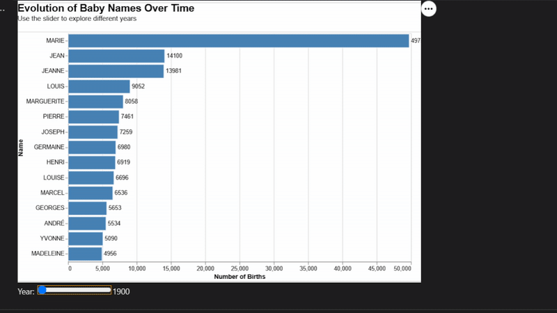
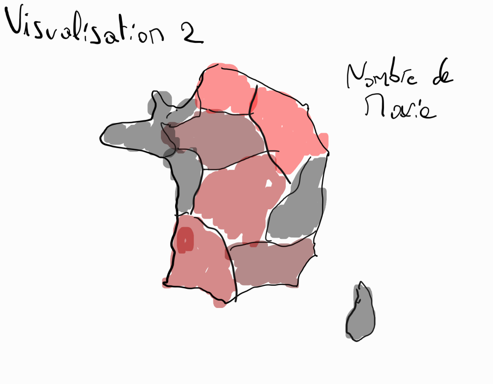
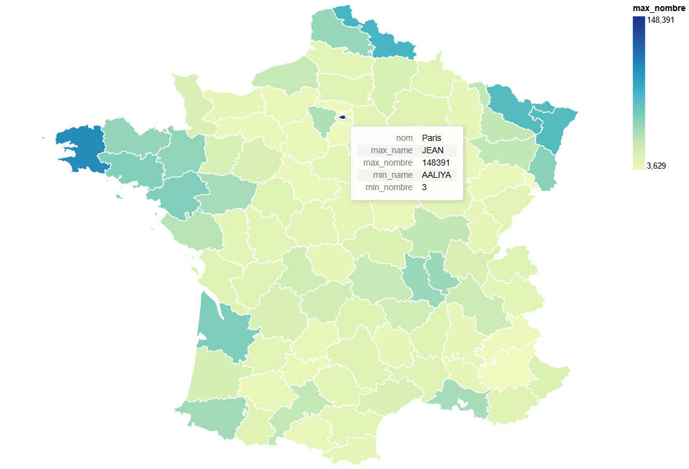
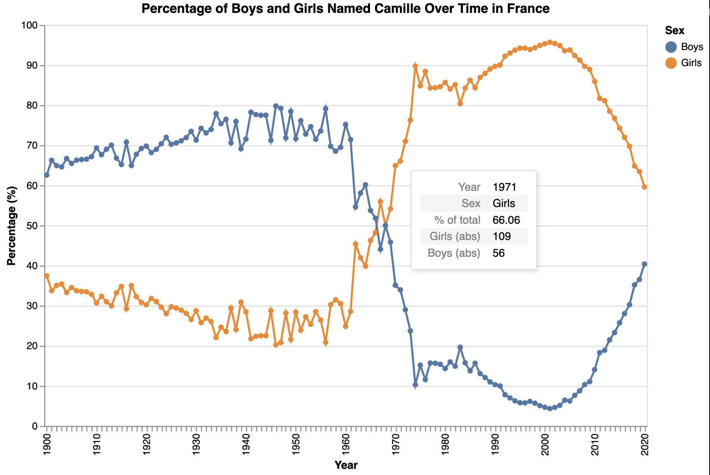

# Running the project :
Each visualisation is its own Notebook to run it you simply run each block in the notebook making sure the necessary libraries are installed.
### libs needed :
- altair
- pandas
- geopandas

# Visualization 1 :

This visualization provides a comprehensive overview of the most popular names in France from 1940 to 2020, it allows users to explore the evolution of names over time through the year slider, which adjusts the data displayed in the chart. The chart displays the top 15 names for each year with the count of each name.

### strengths :
- Allows users to see how the popularity of names has changed over time.
- The year slider provides an interactive way to explore trends in name popularity.
### Weaknesses :
- Too many years to go through i.e. not easy to find trends for a specific era.

# visualization 2 :

This was the sketch for visualization 2, we opted for a different approach where you can hover on different departments to see the largest used name in that department, the number of times it was used and the same for the least used name.

This version is the one we decided on for this first delivrable.

To explore whether certain names are more popular in specific regions, this visualization aggregates the data across all years and displays, for each department, the most frequently used name along with its count. This approach provides an immediate overview of regional patterns by highlighting dominant names in each area. While it doesn’t capture changes over time, it effectively answers the question of whether certain names have a strong regional presence or if popular names are consistently widespread across the country. By focusing on the top name per department, the visualization makes regional contrasts easy to spot at a glance.
### strengths :
- Allows for quickly identifying the most popular name per department.

- Makes it easy to spot departments that have high number of top names.

### Weakneses :
- Doesn’t provide information about the distribution of other names within each department (e.g., how dominant the top name is compared to the others).

- Lacks temporal context — there’s no way to explore how name usage changes over time, as the visualization only shows a static snapshot.

# Visualization 3

Visualization that gives for the chosen name and chosen department displays the name's gender tendecies 
- Y-axis was chosen to display in relative scale (percent of boys-girls) 
- Hover over a datapoint gives acces to absolute numbers

- Future challenge: compare different forms of a name from the chosen "family name" (e.g. Axelle et Axel) 

